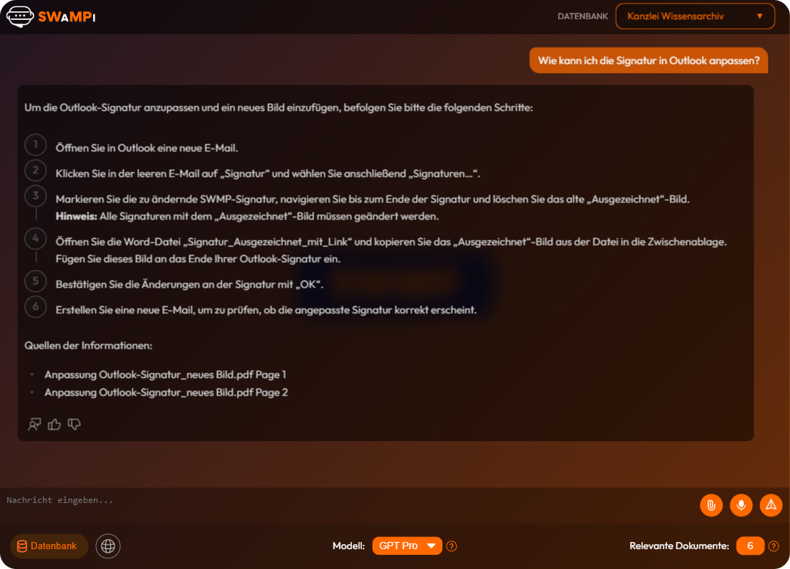

import StorylaneEmbed from '@site/src/components/HomepageFeatures/liveDemo';

# Chat

<StorylaneEmbed />

**SWAMPI** - ist ein KI-gestütztes Chatsystem, das speziell entwickelt wurde, um die Mitarbeiter der Kanzlei SWMP effizient zu unterstützen. Die Anwendung bietet eine benutzerfreundliche Oberfläche, die es ermöglicht, Fragen zu stellen und präzise, fundierte und verständliche Antworten zu erhalten.

Um Antworten zu generieren, greift der Chatbot auf die Dokumente der Kanzlei SWMP zu, die in Form von PDF-Dateien bereitgestellt werden und wichtige Informationen für die Beantwortung der Fragen enthalten.

## Interaktion mit dem Chatbot

Um mit dem Chatbot zu interagieren:
1. Gib deine Nachricht in das Nachrichtenfeld ein.
2. Oder klicke auf die Schaltfläche „Mikrofon“, um deine Nachricht aufzunehmen.
3. Dann klicke auf die Schaltfläche „Senden“ auf der rechten Seite.

### Antwort erhalten

Die Antwort erscheint nach kurzer Bearbeitungszeit im Chat. Der Chatbot benötigt einige Sekunden, um die Anfrage zu verarbeiten und die optimale Antwort zu formulieren. Bitte habe etwas Geduld, während deine Nachricht verarbeitet wird.

### Relevante Dokumente anzeigen

Zusammen mit der Antwort werden relevante Dokumente angezeigt. Wenn mehr als drei Dokumente vorhanden sind, kannst du durch die Dokumentenliste scrollen.

1. Klicke auf „Show Sources“ (rechts neben dem Chat), um die verwendeten Dokumente anzuzeigen.

   

2. Klicke auf ein Dokument, um es zu öffnen.

   

:::note

Die Dokumente werden nur für die jeweilige Antwort angezeigt. Wenn du eine neue Frage stellst, werden die Dokumente für die neue Antwort aktualisiert.

:::

### Chatverlauf

Nachdem eine Antwort generiert wurde, wird der Chatverlauf automatisch gespeichert. Du kannst den Verlauf jederzeit einsehen, indem du auf das Symbol für die Sidebar (oben links) klickst.

Die Sidebar erscheint links mit allen gespeicherten Chats.

:::note

1. Um einen neuen Chat zu starten, klicke auf das Chat-Symbol.
2. Um die alle gespeicherte [Quellen](docs/Benutzer/04_sources.md) anzusehen, klicke auf das Symbol „Quellen“.
3. Um gespeicherte Chats anzusehen, wähle einen Chat aus der Liste aus.
   - Um einen Chat zu löschen, klicke auf das Papierkorb-Symbol neben dem entsprechenden Chat.

:::

### Fehlermeldungen

Falls eine Anfrage nicht korrekt verarbeitet wird, erhältst du eine Fehlermeldung (z. B. „Error“).

Wie du Fehlermeldungen melden kannst, erfährst du im Abschnitt zur [Rückmeldung](docs/Benutzer/03_feedback.md).

