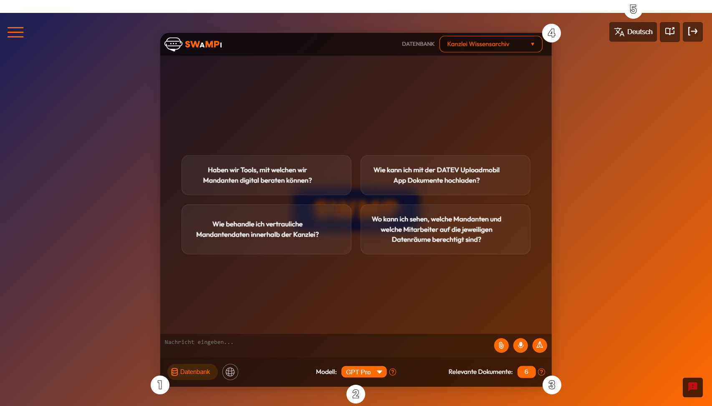
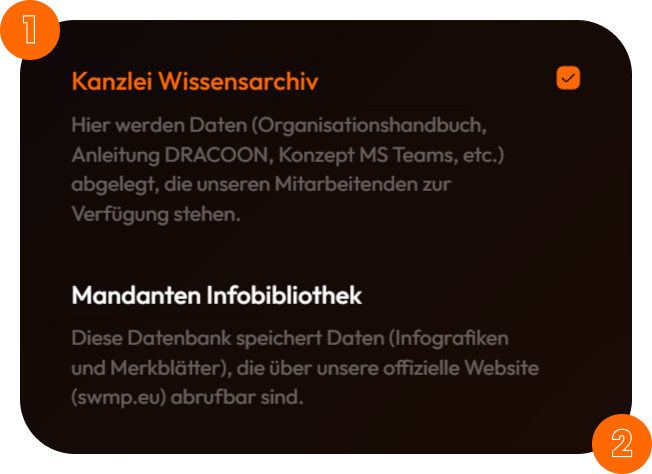

# Einstellungen

Der **SWMP AI Support Assistent** bietet fünf zentrale Einstellungsmöglichkeiten, die dazu beitragen, die Benutzererfahrung zu individualisieren und zu verbessern:

### 1. Kommunikation mit der Datenbank oder dem Internet

1. Aktiviere die Datenbanksuche, um relevante Informationen aus gespeicherten Dokumenten direkt abzurufen. Dadurch werden die Antworten präziser und basieren auf den aktuellsten verfügbaren Daten.

2. Oder aktiviere die Internet-Suche, um Informationen aus dem Internet abzurufen.

:::note

Wenn die Datenbanksuche und die Internet-Suche deaktiviert sind, werden die Antworten ausschließlich auf Basis der aktuellen Frage und des bisherigen Gesprächskontextes erstellt.

:::

### 2. Auswahl der Sprachmodelle
Wähle zwischen verschiedenen Sprachmodellen (KI), um Antworten zu erhalten. Die Modelle unterscheiden sich in Leistungsfähigkeit und Detailgenauigkeit.

Für die Datenbank-Suche:
- **GPT Mini**: Ein leichtgewichtiges Modell für schnelle, aber eventuell weniger präzise Antworten.
- **GPT Pro**: Ein leistungsstärkeres Modell, das detaillierte und präzise Antworten bietet.

Für die Internet-Suche:
- **Sonar-mini**: Ein leichtgewichtiges Modell für schnelle, aber eventuell weniger präzise Antworten mit weniger Quellen.
- **Reasoning**: Ein leistungsstärkeres Modell, das detaillierte und präzise Antworten bietet mit mehr Quellen.
- **Deep Research**: Ein sehr leistungsstarkes Modell, das detaillierte und präzise Antworten bietet mit sehr vielen Quellen.

:::note

Deep Research Suche dauert länger, da mehr Quellen verarbeitet werden (ca. 2-5 Minuten).

:::

### 3. Auswahl der Dokumentenbasis
Bestimme, wie viele Dokumente (zwischen 1 und 10) als Grundlage für die Antworten dienen sollen. Die Auswahl beeinflusst die Genauigkeit der Antwort.

:::tip

Eine größere Anzahl von Dokumenten kann zu allgemeineren Antworten führen, da umfangreichere Informationen berücksichtigt werden.

:::

### 4. Wechsel zwischen Internen und Externen Quellen

Wenn du Datenbank-Suche verwendest, kannst du zwischen internen und externen Quellen wählen.

* **Kanzlei Wissensarchiv**: Hier werden Daten (Organisationshandbuch, Anleitung DRACOON, Konzept MS Teams, etc.) abgelegt, die unseren Mitarbeitenden zur Verfügung stehen.

* **Mandanten Infobibliothek**: Diese Datenbank speichert Daten (Infografiken und Merkblätter), die über unsere offizielle Website [SWMP](https://swmp.eu) abrufbar sind.

### 5. Sprachumschaltung
Wechsle zwischen Deutsch und Englisch, indem du auf das Sprachsymbol klickst, um die Benutzeroberfläche in der gewünschten Sprache anzuzeigen.
