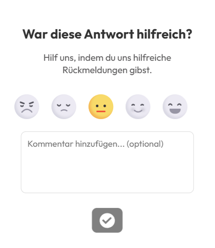

# Rückmeldung

Es gibt zwei Möglichkeiten, Feedback zu geben, falls ein Fehler entdeckt wird oder eine Rückmeldung gewünscht ist:

1. **Fehlermeldung senden**: Wenn ein Fehler auftritt, klicke auf die rote Schaltfläche unten rechts. 

    

    Beschreibe kurz die Art des Fehlers und sende die Nachricht. So hilfst du dabei, den Chatbot kontinuierlich zu verbessern.

2. **Antwort bewerten**: Nach Erhalt einer Antwort werden 3 Optionen zur Bewertung angezeigt. Du kannst entweder Like, Dislike auswählen oder eine ausführliche Bewertung abgeben.

    

    Hier kannst du anonymes Feedback hinterlassen, um anzugeben, wie korrekt und relevant die Antwort für deine Frage war.

    

Bewertungen unterstützen die Qualitätssicherung und die Weiterentwicklung des SWMP AI Support Assistenten.