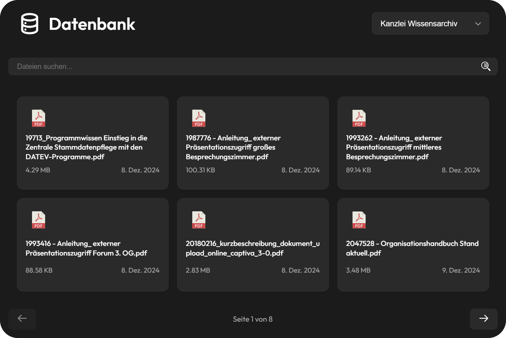
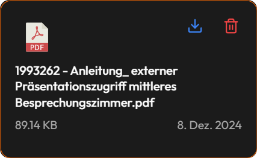

# Quellen

SWAMPI bietet eine Übersicht über alle verfügbaren Dokumente, sowohl aus der internen Datenbank als auch aus externen Quellen. Dadurch hast du jederzeit Zugriff auf relevante Informationen und kannst gezielt mit den Dokumenten arbeiten.

## Dokumentenübersicht

Hier kannst du eine Tabelle der aktuell in der Datenbank gespeicherten Dokumente einsehen. Die Dokumente sind kategorisiert, um eine schnelle Navigation zu ermöglichen:

* **Interne Dokumente (Kanzlei Wissensarchiv)**: Enthält alle unternehmensinternen Dateien, wie das Organisationshandbuch, Richtlinien oder Anleitungen.
* **Externe Dokumente (Mandanten Infobibliothek)**: Umfasst alle öffentlich zugänglichen Informationsquellen, darunter Infografiken, Merkblätter oder Veröffentlichungen auf der offiziellen SWMP-Website.

Diese Übersicht hilft dir zu verstehen, mit welchen Dokumenten du arbeitest und welche Informationen für deine Anfragen herangezogen werden.

## Dokumente herunterladen

Um ein Dokument herunterzuladen, halte die Maus auf das Dokument und klicke auf "Download".

## Dokumente filtern

Um gezielt nach bestimmten Dokumenten zu suchen, kannst du Suchoption benutzen.

