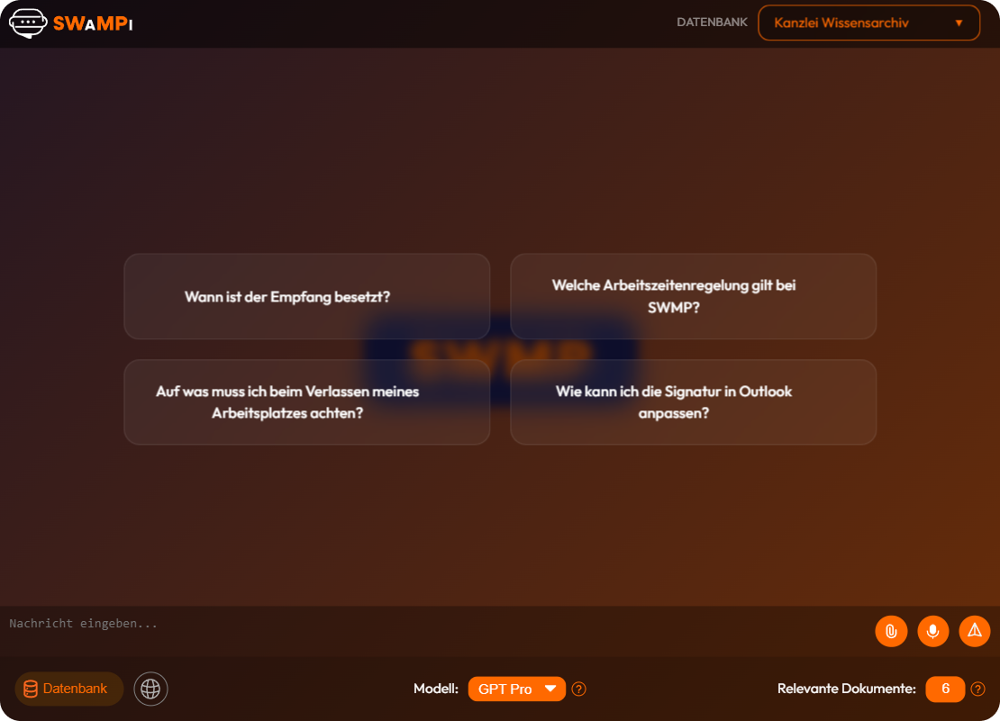

# Chat

Die **SWMP AI Support Assistent** Anwendung ist ein auf KI basierendes Chatsystem, das dazu entwickelt wurde, den Mitarbeitern der Kanzlei SWMP zu unterstützen. Das System bietet eine benutzerfreundliche Oberfläche, um Fragen zu stellen und präzise, fundierte sowie verständliche Antworten zu erhalten.

Um die Antworten zu erhalten, wird der Chatbot auf die Dokumente der Kanzlei SWMP zugreifen. Diese Dokumente werden in Form von PDF-Dateien bereitgestellt und enthalten wichtige Informationen für die Antworten auf die Fragen der Mitarbeiter.

## Interaktion mit dem Chatbot

Um mit dem Chatbot zu interagieren:
1. Geben Sie Ihre Nachricht in das Nachrichtenfeld ein
2. Klicken Sie auf die Schaltfläche "Senden" auf der rechten Seite.

