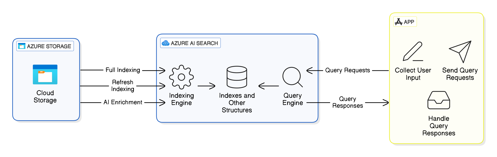

# Azure Cognitive Search for Semantic Search

Zur Optimierung der Dokumentensuche wird Azure Cognitive Search mit Vektorbasierter
Abfrageverarbeitung verwendet.



In Azure Cognitive Search spielen drei Hauptkomponenten (Data Sources, Indexers und Indexes)
eine entscheidende Rolle beim Indizieren und Abrufen von Suchergebnissen:

- **Data Source**: Ist die Quelle, aus der Azure Cognitive Search die Daten extrahiert. Es handelt sich um eine externe Datenbank oder ein Speichersystem, das Azure Cognitive Search verwendet, um den Index zu befüllen.
- **Indexer**: Ist eine automatisierte Pipeline, die Daten aus einer Data Source extrahiert, verarbeitet und in einen Index überführt. Er sorgt dafür, dass die Daten regelmäßig oder nach einem Zeitplan aktualisiert werden.
- **Index**: Ist die Kernkomponente von Azure Cognitive Search, die durchsuchbare Daten speichert. Er funktioniert ähnlich wie eine Tabelle in einer Datenbank, jedoch mit zusätzlichen Suchfunktionen.

Die Indexierung erfolgt über ein vordefiniertes Schema:

```json
{
    "name": "vector",
    "type": "Collection(Edm.Single)",
    "searchable": true,
    "stored": true,
    "dimensions": 1536,
    "vectorSearchProfile": "..."
}
```

Durch die Nutzung von vektorbasierter Suche wird sichergestellt, dass semantisch ähnliche Inhalte effizient abgerufen werden können, selbst wenn die ursprüngliche Suchanfrage nicht exakt mit den gespeicherten Dokumenten übereinstimmt.