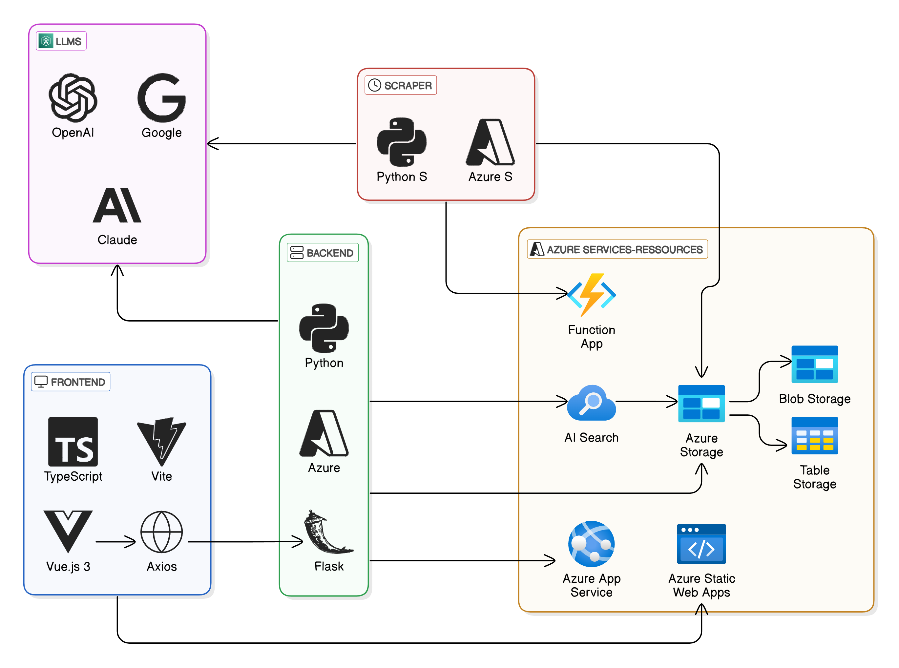

# Azure Deployment

Für die Bereitstellung des SWMP-Chat-Systems wurde Microsoft Azure als Cloud-Plattform ge-
wählt, da sie eine hochskalierbare und sichere Umgebung für die Bereitstellung von
Webanwendungen und KI-gestützten Systemen bietet. Die Hauptkomponenten der Deployment-
Architektur umfassen das Frontend, das Backend, das Scraper, die Datenverarbeitung sowie die
Dokumentensynchronisation.

Das Frontend wird als Azure Static Web App gehostet und nutzt GitHub Actions für automatisierte
Deployments:

* Continuous Integration (CI) / Continuous Deployment (CD): Konfiguration eines GitHub-Actions-Workflows zur Automatisierung von Build- und Deployment-Prozessen.
* Build und Deployment: Nutzung von Azure/static-web-apps-deploy@v1, um das kompilierte Frontend bereitzustellen.
* Automatische Bereinigung von Ressourcen: Nach dem Merge von Pull Requests erfolgt eine automatische Bereinigung von nicht mehr benötigten Ressourcen.

Das Backend wird als Azure App Service bereitgestellt und integriert ebenfalls eine CI/CD-Pipeline
mit GitHub Actions:

* Deployment mittels GitHub Actions: Verwendung von azure/webapps-deploy@v3, um den neuesten Code automatisch zu veröffentlichen.
* Virtuelle Umgebung und Abhängigkeitsmanagement: Installation der notwendigen Python-Abhängigkeiten mittels pip install -r requirements.txt.
* Sichere Bereitstellung: Nutzung von Azure App Service Managed Identity zur Absicherung des Zugriffs auf andere Azure-Ressourcen.