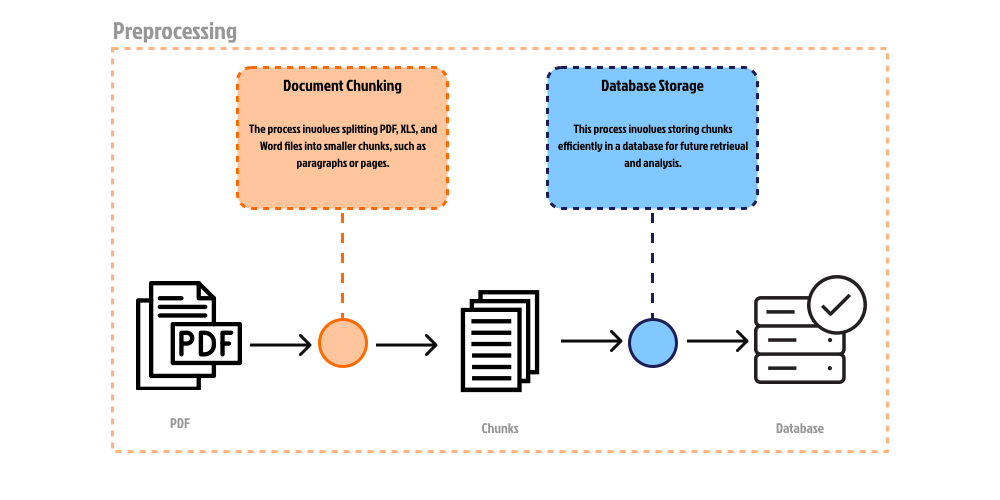
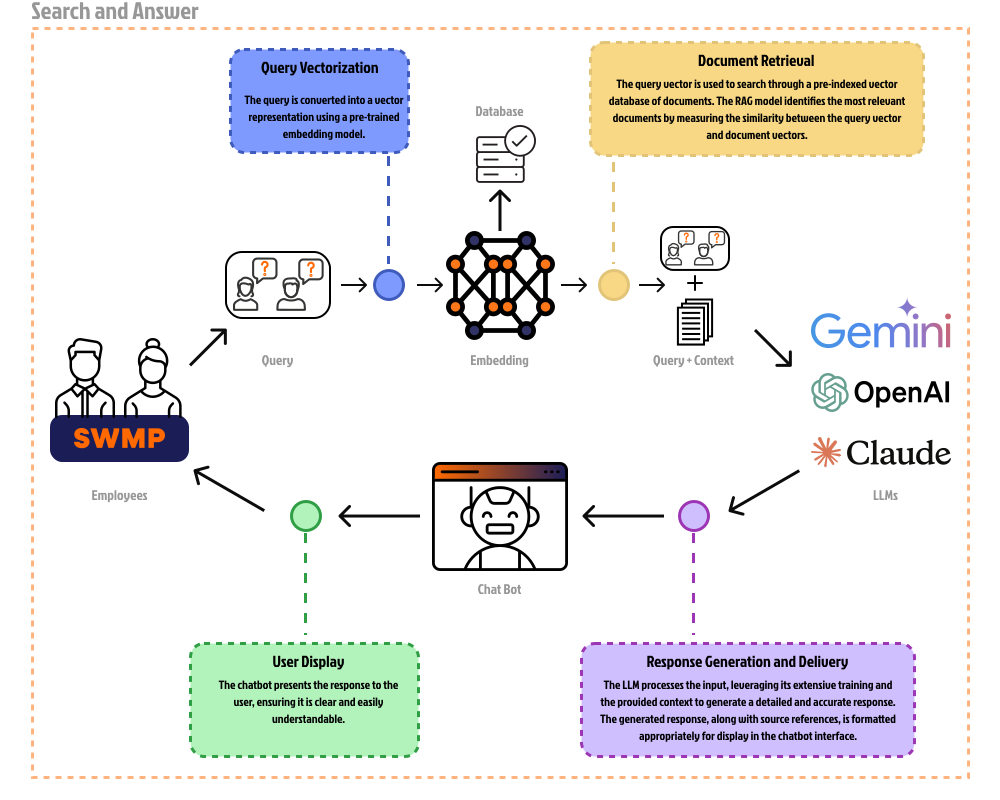

# Internes Wissensmanagement mit RAG

Internes Wissensmanagement kann mithilfe des Retrieval-Augmented Generation (RAG) Modells implementiert werden.

## Vorverarbeitungsphase

* *Abb. 1: zeigt einen schematischen Ablauf des Vorverarbeitungsprozesses für Dokumente. Es ist in zwei Hauptabschnitte “Document Chunking” und “Database Storage” unterteilt.*

Die Vorverarbeitungsphase (Abb. 1) ist entscheidend, um die Effizienz und Genauigkeit des Retrieval-Augmented Generation Modells sicherzustellen.

1. **Document Chunking (Dokument Aufteilung)**: Dieser Schritt umfasst das Aufteilen größerer Dokumente in kleinere, handhabbare Stücke.

   - **Eingabe**: Dokumente in Formaten wie PDF, XLS und Word.
   - **Prozess**:
     - Die Dokumente werden in kleinere Abschnitte wie Absätze oder Seiten aufgeteilt.
     - Dies erleichtert die spätere Verarbeitung und Analyse der Dokumente.
   - **Ausgabe**: Kleinere Dokumentabschnitte (Chunks).

   $$
   \text{Organisationshandbuch (28 Seiten)} \rightarrow \begin{bmatrix}
   \text{OHB}\ (1) \\
   \dots \\
   \text{OHB}\ (28)
   \end{bmatrix} \in \mathbb{R}^{28 \times 1}
   $$

2. **Database Storage (Speicherung in der Datenbank)**: Diese Phase umfasst die effiziente Speicherung der Dokumentabschnitte in einer Datenbank.

   - **Prozess**:
     - Die erzeugten Chunks werden in einer Datenbank gespeichert.
     - Dies ermöglicht eine effiziente Abrufbarkeit und Analyse der Daten in der Zukunft.
   - **Ausgabe**: Eine organisierte Datenbank mit gespeicherten Chunks.

## Such- und Antwortphase

* *Abb. 2: zeigt einen schematischen Ablauf des Such- und Antwortprozesses in einem System, das auf Embedding- und LLMs Modell basiert.*

Die Such- und Antwortphase (Abb. 2) beschreibt den Ablauf, wenn ein Benutzer eine Anfrage stellt und das RAG-Modell eine Antwort generiert.

1. **Query Vectorization (Vektorisierung der Abfrage)**: Die Abfrage (Query) vom Mitarbeiter wird in eine Vektorrepräsentation umgewandelt, um sie mit einem vortrainierten Embeddings Model zu verarbeiten.

   - **Prozess**: Eine Benutzerabfrage wird in einen Vektor umgewandelt, der in einem vektorisierten Format in die Datenbank eingegeben werden kann.
   - **Ausgabe**: Vektorisierte Abfragen.

   $$
   \text{Wie kann ich einen Urlaub beantragen?}\rightarrow M = \begin{bmatrix}
   0.01564 \\
   \dots \\
   0.11552
   \end{bmatrix} \in \mathbb{R}^{1536 \times 1}
   $$

2. **Document Retrieval (Dokumentenabruf)**: Die vektorisierte Abfrage wird verwendet, um in einer Datenbank nach den relevantesten Dokumenten zu suchen.

   - **Prozess**: Das RAG-Modell (Retrieval-Augmented Generation) durchsucht die Datenbank und identifiziert die relevantesten Dokumente, indem es die Ähnlichkeit $\forall i, \;\text{sim}(v, M_i)$ zwischen Abfragevektoren $v \in \mathbb{R}^{1536 \times 1}$ und Dokumentenvektoren $M_i \in \mathbb{R}^{28 \times 1536}$ misst.

   $$
   v =
   \begin{bmatrix}
   0.01564 \\
   \vdots \\
   0.11552
   \end{bmatrix} \in \mathbb{R}^{1536 \times 1}, M =
   \begin{bmatrix}
   -0.04354 & \dots & 0.03183  \\
   \dots & \dots & \dots \\
   -0.05502 & \dots & 0.05852
   \end{bmatrix} \in \mathbb{R}^{28 \times 1536}
   $$
   
   - **Ausgabe**: Die am besten passenden Dokumente und Kontexte zur Abfrage.

   $$
   \begin{bmatrix}
   \text{OHB}\ (20) \\
   \text{OHB}\ (21) \\
   \text{OHB}\ (23) \\
   \end{bmatrix} \in \mathbb{R}^{3 \times 1}
   $$

3. **Response Generation and Delivery (Antwortgenerierung und -lieferung)**: Der Prozess zur Generierung und Bereitstellung einer detaillierten und genauen Antwort durch das LLM (Large Language Model).

   - **Prozess**: Das LLM verarbeitet die Abfrage zusammen mit den abgerufenen Dokumenten (Query + Context) und generiert eine umfassende Antwort. Quellenangaben und Kontext werden zur Antwort hinzugefügt.
   - **Ausgabe**: Eine formatierte Antwort, bereit zur Anzeige im Chatbot-Interface.

4. **User Display (Benutzeranzeige)**: Präsentation der generierten Antwort an den Benutzer in einer klaren und verständlichen Weise.

   - **Prozess**: Der Chatbot zeigt die Antwort dem Benutzer an und stellt sicher, dass sie leicht verständlich ist.
   - **Ausgabe**: Die angezeigte Antwort für den Benutzer.