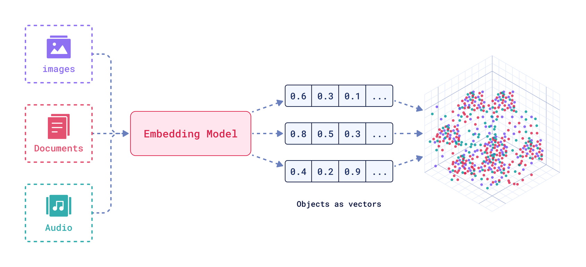

# Retrieval-Augmented Generation

Retrieval-Augmented Generation (RAG) ist eine Technik im Bereich des Natural Language Processing (NLP), die darauf abzielt, generative Modelle durch das Hinzufügen von externen Wissensdatenbanken oder Dokumenten zu verbessern.

*Folge zeigt den technischen Ablauf eines Retrieval-Augmented Generation (RAG) Systems dar, das für die Beantwortung von Benutzeranfragen verwendet wird und die Hauptphasen umfasst: Eingabe (Input), Indexierung (Indexing), Abruf (Retrieval-Augmentation), Generierung (Generation) und Ausgabe (Output).*

## Schritte des RAG-Systems

1. **Indexing (Indexierung)**: Dokumente werden in Chunks (Textblöcke) aufgeteilt, die durch Vektorisierung in Embeddings (Vektoren) umgewandelt werden. Die Embeddings werden gespeichert, um die schnelle Suche nach relevanten Inhalten zu ermöglichen.

2. **Input (Eingabe)**: Ein Benutzer stellt eine Anfrage (Query), die an das System übergeben und als ein Vektor im semantischen Raum dargestellt wird.

3. **Retrieval (Abruf)**: Der Prozess des Abrufens von relevanten Dokumenten oder Informationen aus einer Datenbank oder Sammlung basierend auf einer gegebenen Anfrage oder Query. Das Embedding-Modell transformiert die Query in einen Vektorraum. Danach wird eine Menge von Dokumenten oder Wissensdaten aus einer Datenbank abgerufen. Der Retriever durchsucht eine vordefinierte Sammlung von Texten (interne Datenbanken), berechnet die Ähnlichkeit zwischen Vektorräumen der Query und Dokumenten und liefert die relevantesten Dokumente für die gegebene Query zurück.

   
   *Folge zeigt den Prozess der Umwandlung verschiedener Datentypen (Bilder, Dokumente, Audio) in Vektoren mithilfe eines Embedding-Modells.*

4. **Augmented Generation (Erweiterte Generierung)**: Generierung der Antwort basierend auf die Query und Kontext (relevante Dokumente). Der generative Teil, oft ein großes Sprachmodell (GPT, Gemini oder Claude), wird dann mit den abgerufenen Dokumenten und der Query gefüttert. Das Sprachmodell verwendet diese zusätzlichen Informationen, um eine präzisere und kontextbezogenere Antwort zu generieren.

5. **Output (Ausgabe)**: Falls die Informationen nicht im Modell gespeichert sind, kann es keine gute Antwort liefern (ohne RAG). RAG ermöglicht es dem Modell, auf eine große Menge aktueller und externer Informationen zuzugreifen, um fundierte und relevante Antworten zu liefern.