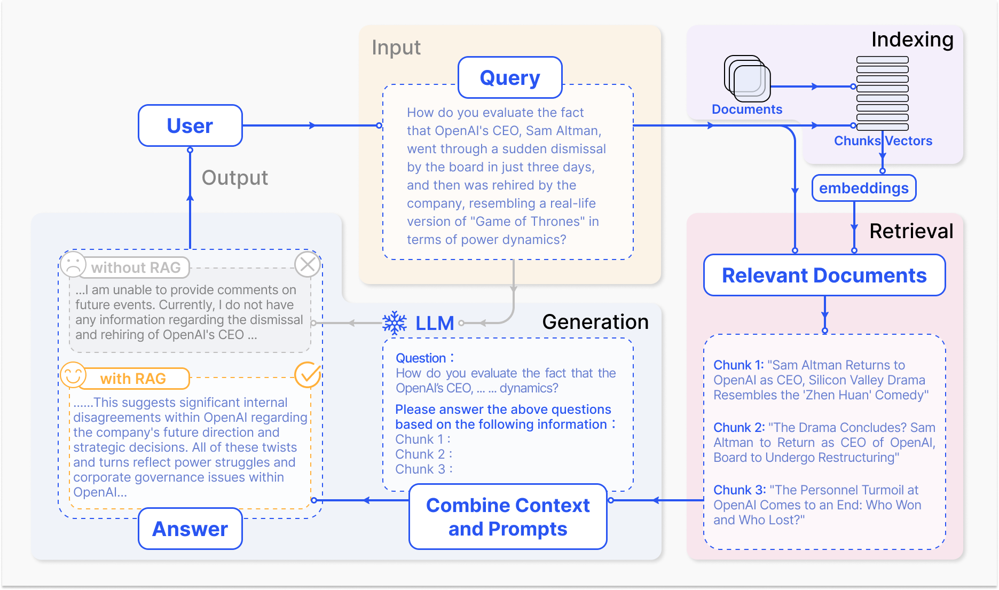
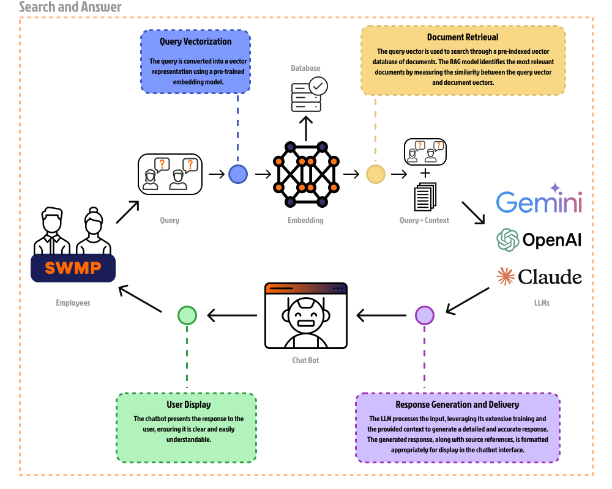

# Retrieval-Augmented Generation

Retrieval-Augmented Generation (RAG) ist eine Technik im Bereich des Natural Language Processing (NLP), die darauf abzielt, generative Modelle durch das Hinzufügen von externen Wissensdatenbanken oder Dokumenten zu verbessern.

*Abb. 1: zeigt den technischen Ablauf eines Retrieval-Augmented Generation (RAG) Systems dar, das für die Beantwortung von Benutzeranfragen verwendet wird und die Hauptphasen umfasst: Eingabe (Input), Indexierung (Indexing), Abruf (Retrieval-Augmentation), Generierung (Generation) und Ausgabe (Output).*

1. **Indexing (Indexierung)**: Dokumente werden in Chunks (Textblöcke) aufgeteilt, die durch Vektorisierung in Embeddings (Vektoren) umgewandelt werden. Die Embeddings werden gespeichert, um die schnelle Suche nach relevanten Inhalten zu ermöglichen.

2. **Input (Eingabe)**: Ein Benutzer stellt eine Anfrage (Query), die an das System übergeben und als ein Vektor im semantischen Raum dargestellt wird.

3. **Retrieval (Abruf)**: Der Prozess des Abrufens von relevanten Dokumenten oder Informationen aus einer Datenbank oder Sammlung basierend auf einer gegebenen Anfrage oder Query. Das Embedding-Modell transformiert die Query in einen Vektorraum. Danach wird eine Menge von Dokumenten oder Wissensdaten aus einer Datenbank abgerufen. Der Retriever durchsucht eine vordefinierte Sammlung von Texten (interne Datenbanken), berechnet die Ähnlichkeit zwischen Vektorräumen der Query und Dokumenten und liefert die relevantesten Dokumente für die gegebene Query zurück.

   
   *Abb. 2: zeigt den Prozess der Umwandlung verschiedener Datentypen (Bilder, Dokumente, Audio) in Vektoren mithilfe eines Embedding-Modells.*

4. **Augmented Generation (Erweiterte Generierung)**: Generierung der Antwort basierend auf die Query und Kontext (relevante Dokumente). Der generative Teil, oft ein großes Sprachmodell (GPT, Gemini oder Claude), wird dann mit den abgerufenen Dokumenten und der Query gefüttert. Das Sprachmodell verwendet diese zusätzlichen Informationen, um eine präzisere und kontextbezogenere Antwort zu generieren.

5. **Output (Ausgabe)**: Falls die Informationen nicht im Modell gespeichert sind, kann es keine gute Antwort liefern (ohne RAG). RAG ermöglicht es dem Modell, auf eine große Menge aktueller und externer Informationen zuzugreifen, um fundierte und relevante Antworten zu liefern.

## Embedding und TF-IDF

TF-IDF und Word Embeddings (z.B. Word2Vec, BERT) sind beides Techniken zur numerischen Darstellung von Wörtern, sie unterscheiden sich jedoch grundlegend in ihrer Funktionsweise und Anwendung.

### TF-IDF

TF-IDF steht für Term Frequency-Inverse Document Frequency. Es ist eine Methode aus der Information Retrieval und Textmining, die dazu verwendet wird, die Wichtigkeit eines Wortes in einem Dokument in Bezug auf eine Sammlung von Dokumenten (Korpus) zu bestimmen. TF-IDF kombiniert zwei Metriken:

$$\text{TF-IDF} = TF(t,d) \times IDF(t,D)$$

**Term Frequency (TF)**: Die Häufigkeit eines Begriffs in einem Dokument. TF misst, wie oft ein Begriff in einem Dokument vorkommt:

$$TF(t,d) = \frac{f(t,d)}{\sum_{t\in d} f(t',d)}$$

- $t$ ist der Begriff.
- $d$ ist das Dokument.
- $f(t,d)$ ist die Häufigkeit des Begriffs $t$ im Dokument $d$.
- $\sum_{t\in d} f(t',d)$ ist die Gesamtanzahl der Begriffe im Dokument $d$.

**Inverse Document Frequency (IDF)**: Die Umkehrung der Dokumenthäufigkeit, die misst, wie wichtig ein Begriff ist. Je seltener ein Begriff in allen Dokumenten vorkommt, desto höher ist der IDF-Wert:

$$IDF(t,D) = \log\left(\frac{N}{|\{d\in D: t \in d\}|}\right)$$

- $D$ ist das Korpus (eine Sammlung von Dokumenten).
- $N$ ist die Gesamtzahl der Dokumente im Korpus.
- $|\{d\in D: t \in d\}|$ ist die Anzahl der Dokumente, die den Begriff ($t$) enthalten.

### Word Embedding

**Word Embeddings** sind eine fortschrittlichere Methode zur numerischen Darstellung von Wörtern, die auf der Idee basiert, dass Wörter in einem Vektorraum dargestellt werden, wobei ähnliche Wörter durch Vektoren repräsentiert werden, die sich nahe beieinander befinden. Diese Technik ermöglicht es, semantische Ähnlichkeiten und Beziehungen zwischen Wörtern besser zu erfassen als TF-IDF.

Im Gegensatz zu TF-IDF, das auf der Häufigkeit von Begriffen basiert, lernen Word Embeddings kontinuierliche Vektoren, die die Bedeutung von Wörtern durch deren Kontext in großen Textmengen erfassen. Es gibt verschiedene Ansätze zur Erstellung von Word Embeddings, darunter Word2Vec und BERT.

### Kosinusähnlichkeit

Die Kosinusähnlichkeit misst, wie ähnlich zwei Vektoren in einem hochdimensionalen Raum sind, basierend auf dem Winkel zwischen ihnen.

Um die Kosinusähnlichkeit zwischen dem **Abfragevektor** $$ q= \begin{bmatrix}
q_1 \\
\dots \\
q_{n}
\end{bmatrix} \in \mathbb{R}^{n\times1} $$ 

und Dokumentenvektoren $$ D = \begin{bmatrix}
d_{1,1} & \dots & d_{1,n}  \\
\dots & \dots & \dots \\
d_{m,1} & \dots & d_{m,n}
\end{bmatrix} \in \mathbb{R}^{m\times n} $$ 

zu berechnen, kann folgende Formel benutzt werden: $$sim(q,d_i) = \frac{q \cdot d_i}{||q|| \cdot ||d_i||}$$

- Skalarprodukt zwischen der Abfrage und jedem Dokument: $q \cdot d_i = \sum_{j=1}^{N} q_j \times d_{i,j}$.
- Normen der Vektoren: $||v|| = \sqrt{\sum_{j=1}^{N} v_j^2}$.

### Embedding vs TF-IDF

TF-IDF (Term Frequency-Inverse Document Frequency) ist schneller als Word Embedding in vielen Anwendungsfällen, selbst wenn die Anzahl der Dimensionen in TF-IDF höher ist.

- Berechnung von TF-IDF-Werten ist relativ einfach und beinhaltet nur das Zählen von Wörtern und die Berechnung von Frequenzverhältnissen.
- Die resultierende TF-IDF-Matrix ist in der Regel spärlich, das heißt, sie enthält viele Nullen.

| Zeit                                        | TF-IDF          | Embedding          |
|---------------------------------------------|------------------|--------------------|
| Theoretische Ausführungszeit                | 941 µs ± 45 µs  | 19.7 ms ± 1.44 ms  |
| Durchschnittliche Ausführungszeit für 93 Seiten | 0.001 s         | 0.02 s             |

Word Embedding Modelle haben mehrere Vorteile gegenüber traditionellen Methoden wie TF-IDF, insbesondere in Anwendungen der natürlichen Sprachverarbeitung.

- Sie lernen Vektorrepräsentationen für Wörter basierend auf ihrem Kontext, was bedeutet, dass semantisch ähnliche Wörter ähnliche Vektoren haben.
- Sie sind in der Lage, Synonyme zu erkennen und Wörter mit mehreren Bedeutungen korrekt zu platzieren, basierend auf ihrem Kontext.

| Methode   | Pros                                                               | Cons                                                        |
|-----------|--------------------------------------------------------------------|-------------------------------------------------------------|
| TF-IDF    | Einfach zu implementieren, effizient für kleine bis mittlere Datensätze, keine Notwendigkeit für vortrainierte Modelle. | Erfasst keine semantische Bedeutung, behandelt jedes Wort unabhängig von seinem Kontext. |
| Embedding | Erfasst semantische Ähnlichkeiten, reduziert die Dimension der Daten, verbessert die Leistung in vielen NLP-Aufgaben. | Erfordert vortrainierte Modelle und mehr Rechenressourcen, komplexer zu implementieren. |

## Internes Wissensmanagement mit RAG

Internes Wissensmanagement kann mithilfe des Retrieval-Augmented Generation (RAG) Modells implementiert werden.

### Vorverarbeitungsphase

* *Abb. 3: zeigt einen schematischen Ablauf des Vorverarbeitungsprozesses für Dokumente. Es ist in zwei Hauptabschnitte “Document Chunking” und “Database Storage” unterteilt.*

Die Vorverarbeitungsphase (Abb. 1) ist entscheidend, um die Effizienz und Genauigkeit des Retrieval-Augmented Generation Modells sicherzustellen.

1. **Document Chunking (Dokument Aufteilung)**: Dieser Schritt umfasst das Aufteilen größerer Dokumente in kleinere, handhabbare Stücke.

   - **Eingabe**: Dokumente in Formaten wie PDF, XLS und Word.
   - **Prozess**:
     - Die Dokumente werden in kleinere Abschnitte wie Absätze oder Seiten aufgeteilt.
     - Dies erleichtert die spätere Verarbeitung und Analyse der Dokumente.
   - **Ausgabe**: Kleinere Dokumentabschnitte (Chunks).

   $$
   \text{Organisationshandbuch (28 Seiten)} \rightarrow \begin{bmatrix}
   \text{OHB}\ (1) \\
   \dots \\
   \text{OHB}\ (28)
   \end{bmatrix} \in \mathbb{R}^{28 \times 1}
   $$

2. **Database Storage (Speicherung in der Datenbank)**: Diese Phase umfasst die effiziente Speicherung der Dokumentabschnitte in einer Datenbank.

   - **Prozess**:
     - Die erzeugten Chunks werden in einer Datenbank gespeichert.
     - Dies ermöglicht eine effiziente Abrufbarkeit und Analyse der Daten in der Zukunft.
   - **Ausgabe**: Eine organisierte Datenbank mit gespeicherten Chunks.

### Such- und Antwortphase

* *Abb. 4: zeigt einen schematischen Ablauf des Such- und Antwortprozesses in einem System, das auf Embedding- und LLMs Modell basiert.*

Die Such- und Antwortphase (Abb. 2) beschreibt den Ablauf, wenn ein Benutzer eine Anfrage stellt und das RAG-Modell eine Antwort generiert.

1. **Query Vectorization (Vektorisierung der Abfrage)**: Die Abfrage (Query) vom Mitarbeiter wird in eine Vektorrepräsentation umgewandelt, um sie mit einem vortrainierten Embeddings Model zu verarbeiten.

   - **Prozess**: Eine Benutzerabfrage wird in einen Vektor umgewandelt, der in einem vektorisierten Format in die Datenbank eingegeben werden kann.
   - **Ausgabe**: Vektorisierte Abfragen.

   $$
   \text{Wie kann ich einen Urlaub beantragen?}\rightarrow M = \begin{bmatrix}
   0.01564 \\
   \dots \\
   0.11552
   \end{bmatrix} \in \mathbb{R}^{1536 \times 1}
   $$

2. **Document Retrieval (Dokumentenabruf)**: Die vektorisierte Abfrage wird verwendet, um in einer Datenbank nach den relevantesten Dokumenten zu suchen.

   - **Prozess**: Das RAG-Modell (Retrieval-Augmented Generation) durchsucht die Datenbank und identifiziert die relevantesten Dokumente, indem es die Ähnlichkeit $\forall i, \;\text{sim}(v, M_i)$ zwischen Abfragevektoren $v \in \mathbb{R}^{1536 \times 1}$ und Dokumentenvektoren $M_i \in \mathbb{R}^{28 \times 1536}$ misst.

   $$
   v =
   \begin{bmatrix}
   0.01564 \\
   \vdots \\
   0.11552
   \end{bmatrix} \in \mathbb{R}^{1536 \times 1}, M =
   \begin{bmatrix}
   -0.04354 & \dots & 0.03183  \\
   \dots & \dots & \dots \\
   -0.05502 & \dots & 0.05852
   \end{bmatrix} \in \mathbb{R}^{28 \times 1536}
   $$
   
   - **Ausgabe**: Die am besten passenden Dokumente und Kontexte zur Abfrage.

   $$
   \begin{bmatrix}
   \text{OHB}\ (20) \\
   \text{OHB}\ (21) \\
   \text{OHB}\ (23) \\
   \end{bmatrix} \in \mathbb{R}^{3 \times 1}
   $$

3. **Response Generation and Delivery (Antwortgenerierung und -lieferung)**: Der Prozess zur Generierung und Bereitstellung einer detaillierten und genauen Antwort durch das LLM (Large Language Model).

   - **Prozess**: Das LLM verarbeitet die Abfrage zusammen mit den abgerufenen Dokumenten (Query + Context) und generiert eine umfassende Antwort. Quellenangaben und Kontext werden zur Antwort hinzugefügt.
   - **Ausgabe**: Eine formatierte Antwort, bereit zur Anzeige im Chatbot-Interface.

4. **User Display (Benutzeranzeige)**: Präsentation der generierten Antwort an den Benutzer in einer klaren und verständlichen Weise.

   - **Prozess**: Der Chatbot zeigt die Antwort dem Benutzer an und stellt sicher, dass sie leicht verständlich ist.
   - **Ausgabe**: Die angezeigte Antwort für den Benutzer.